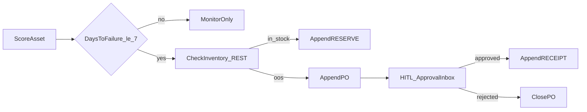

# BPM / Appian object mapping (Track C Phase 3)

This portfolio does **not** claim Appian Designer experience. It maps the same
process patterns Appian/Bus Tech roles ship: records, process models, integrations,
and human tasks — implemented here with Spring Boot + Postgres + LangGraph.

## Reference process: predictive spare-parts procurement

## Appian-shaped objects ↔ this repo

| Appian concept | Artifact in this monorepo |
| --- | --- |
| Record type (Parts) | Postgres `parts` + view `v_parts_on_hand` |
| Record type (Approval) | `approval_queue` + view `v_open_approvals` + `/inbox` |
| Process model | LangGraph graph in `predictive-maintenance-agent/run_agent.py` |
| Integration (connected system) | Spring REST / JDBC `parts-inventory-api` |
| Write to DS | Append-only `stock_movements`, `workflow_events`, `agent_cases` |
| User input task / HITL | `/inbox` + `POST /api/webhooks/po-approved` |
| Expression rules / policy | `shared/policy.py` + `shared/thresholds.py` |
| Sites / tempo-like list | Thymeleaf inbox (minimal case list) |
| AI skill / summarization | `insights.py` grounded on `workflow_events` with `event_id` citations |

## As-is → to-be (stakeholder language)

| | As-is | To-be (this system) |
| --- | --- | --- |
| Trigger | Technician notices vibration | Model scores days-to-failure |
| Inventory | Spreadsheet / tribal knowledge | REST + JDBC source of truth |
| PO | Email draft, lost in inbox | Appended PO + approval queue id |
| Audit | Chat threads | `workflow_events` append ledger |
| SLA | Informal | Threshold 7 days; high-cost HITL ≥ $1000 |

## RACI (demo)

| Step | Responsible | Accountable | Consulted | Informed |
| --- | --- | --- | --- | --- |
| Score asset | Agent | Reliability eng | — | Ops |
| Reserve / draft PO | Agent + Inventory API | Maintenance lead | Purchasing | Warehouse |
| Approve PO | Manager (HITL) | Maintenance lead | Finance if high cost | Agent case log |

## Interview one-liner

> “I modeled an Appian-style procurement process outside Appian: durable records in Postgres, a process graph with HITL, REST/JDBC integrations, and AI that cites workflow event IDs — ready to re-implement as Appian records + process + connected system.”
